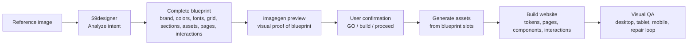

# 9Designer

> Blueprint-first image-to-website Codex skill: reference image -> locked blueprint -> imagegen preview -> confirmation -> generated assets -> deploy-ready website.

[](LICENSE)
[](skills/)
[](#how-it-works)

9Designer is an installable Codex skill suite for turning a single reference image into a real website. The current source of truth is [`skills/9designer/SKILL.md`](skills/9designer/SKILL.md): it writes the full website blueprint first, renders that blueprint as an `imagegen` visual for review, waits for confirmation, then generates assets and builds the working site directly from the locked blueprint.

The old mental model was design -> assets -> website. The current model is stricter:

1. Analyze the reference image and any user-provided category.
2. Write the complete structured blueprint before generating or coding anything.
3. Generate an `imagegen` preview from that blueprint.
4. Pause for user confirmation.
5. Generate all assets from the blueprint asset slots.
6. Build every page, token, component, and interaction from the blueprint.

## Preview

The public **Dreaming** images are retained as a visual benchmark and showcase set.

| Landing page | Brand kit |
| --- | --- |
|  |  |

| UI components | Responsive preview |
| --- | --- |
|  |  |


## Source Of Truth

The authoritative workflow lives in:

```text
skills/9designer/SKILL.md
```

Docs, examples, and helper skills should support that blueprint-first process. They should not redefine the workflow in a way that lets the website builder improvise after approval.

The optional reference modules live in:

```text
skills/9designer/references/
  v5-workflow.md
  v5-image-analysis.md
  v5-token-exports.md
  v5-pixel-diff.md
  v5-optional-integrations.md
```

These files describe advanced workflow notes, image analysis, token exports, pixel-diff QA, and optional integrations. They are accelerators, not a replacement for the main skill.

## How It Works



Core rule:

```text
Blueprint is the contract.
Imagegen is the preview.
Code is the output.
```

## Skills

| Skill | Role | Use when |
| --- | --- | --- |
| `$9designer` | Primary source-of-truth workflow | You want one reference image turned into a confirmed blueprint, generated assets, and a working website |
| `$9image-design` | Modular design helper | You only want design exploration before website build |
| `$9design-assets` | Modular production asset helper | You already have approved designs and need clean export assets |
| `$9assets-website` | Modular website builder helper | You already have an asset export folder and reconstruction contract |
| `$9design-kit` | Expanded brand/UI kit helper | You want a deeper design-system handoff |

## Install

Copy the folders under `skills/` into your Codex skills folder.

Typical user skills folder:

```text
~/.codex/skills/
```

Project-local skill folder:

```text
<project>/.agents/skills/
```

Recommended install layout:

```text
~/.codex/skills/
  9designer/
  9image-design/
  9design-assets/
  9design-kit/
  9assets-website/
```

## Quick Start

Attach a reference image in Codex and say:

```text
Use $9designer with this reference image.

Write the complete website blueprint first. Then generate one imagegen preview from that blueprint and pause for my confirmation.

After I say GO, generate every asset from the blueprint asset list and build the complete responsive website directly from the blueprint.
```

After the preview is generated, respond with one of the confirmation signals from the skill, such as:

```text
GO
```

If the preview needs changes, ask for the change before saying `GO`. The blueprint must be updated first, then the preview must be regenerated from the updated blueprint.

## What Makes 9Designer Different

- **Blueprint-first:** all design values, asset slots, sections, pages, and interactions are locked before code.
- **Imagegen as proof:** the generated preview is a visual rendering of the blueprint, not a separate design direction.
- **Approval-gated:** website build starts only after the user confirms the blueprint preview.
- **Asset-slot discipline:** logos, icons, backgrounds, cards, motifs, and overlays are generated from named blueprint slots.
- **No generic replacements:** social icons, decorative marks, and UI icons must match the reference world or use verified official marks.
- **Code-native text:** navigation, headings, paragraphs, buttons, forms, and footer copy stay real HTML/CSS whenever possible.
- **Token-driven build:** `tokens.css`, optional `tokens.json`, and optional `tailwind.config.js` are derived from the blueprint values.
- **Responsive by contract:** desktop, tablet, mobile, and small-mobile behavior are specified before implementation.
- **Repair loop expected:** the first render is not final; visual QA drives targeted fixes before handoff.

## Modular Helpers

The helper skills remain useful for controlled workflows:

```text
$9image-design
reference image -> approved visual design

$9design-assets
approved design -> clean production assets

$9assets-website
assets + reconstruction contract -> working website

$9design-kit
approved design -> expanded brand/UI system
```

For new end-to-end work, prefer `$9designer` unless you intentionally want to split the run.

## Background Cleanup

`$9design-assets` includes:

```text
skills/9design-assets/scripts/remove_background.py
```

Use it after image generation for logos, icons, overlays, dividers, and reusable UI assets:

```bash
python skills/9design-assets/scripts/remove_background.py --input generated.png --output cleaned.png --mode auto
```

`--mode auto` preserves existing alpha, uses optional `rembg` when installed, then falls back to bundled edge-connected cleanup with clear guidance.

The exporter manifest tracks:

```text
asset_role
responsive_variants
accessibility
token_dependencies
icon_policy
qa_notes
background_cleanup_required
background_cleaned
alpha_verified
background_removal_needed
```

Validate an export folder before website handoff:

```bash
python skills/9design-assets/scripts/validate_asset_manifest.py asset-exports/<project> --check-files
```

Do not pass checkerboard-backed or screenshot-backed reusable assets into `$9assets-website`.

## Visual QA Helpers

`$9assets-website` includes optional helpers for final website comparison:

```bash
python skills/9assets-website/scripts/create_fast_track_plan.py --website-root .
python skills/9assets-website/scripts/create_reconstruction_contract.py --website-root . --asset-export asset-exports/<project>
node skills/9assets-website/scripts/capture_visual_qa.mjs --url http://localhost:5173 --out visual-qa/screenshots
node skills/9assets-website/scripts/compare_visual_qa.mjs --reference-dir visual-qa/reference --actual-dir visual-qa/screenshots --out visual-qa/diffs
python skills/9assets-website/scripts/create_visual_qa_ledger.py --website-root . --summary visual-qa/diffs/visual-qa-diff-summary.json
python skills/9assets-website/scripts/score_visual_qa.py --ledger docs/research/VISUAL_QA_LEDGER.md --build-passed --out docs/research/VISUAL_BENCHMARK_SCORE.md
python skills/9assets-website/scripts/validate_production_readiness.py --website-root . --strict
```

Playwright, pixelmatch, pngjs, rembg, SAM, SVGO, Sharp, Pillow, ImageMagick, Figma, Penpot, p5.js, and Three.js are optional accelerators. If they are unavailable, the skill still requires manual visual QA and a repair ledger.

## Benchmark Gallery

Start with the public [Dreaming benchmark seed](docs/examples/dreaming/README.md), then use the [scoring rubric](docs/examples/SCORING_RUBRIC.md) to judge future examples and final website builds.

## Repository Layout

```text
skills/
  9designer/
    SKILL.md
    references/
  9image-design/
  9design-assets/
  9design-kit/
  9assets-website/
docs/
  examples/
  media/
  GETTING_STARTED.md
  EXAMPLES.md
  RESEARCH_NOTES.md
  CONTRIBUTOR_WORKFLOW.md
  VALIDATION.md
  GITHUB_SETTINGS.md
.github/
  ISSUE_TEMPLATE/
  PULL_REQUEST_TEMPLATE.md
```

## Contributing

Contributions are welcome when they improve blueprint precision, visual reconstruction fidelity, asset cleanup, design-token output, responsive implementation, QA automation, docs, examples, or validation.

Good first contributions:

- Better blueprint fields for repeated website patterns.
- Better reference-image analysis prompts.
- Better asset cleanup and transparency checks.
- Example outputs from new reference styles.
- More precise visual QA and repair-loop guidance.
- Documentation fixes that make the skill easier to install or use.

Start with [CONTRIBUTING.md](CONTRIBUTING.md), then open an issue or pull request using the templates.

## Maintainer Notes

Suggested GitHub repository settings:

- Description: `Blueprint-first image-to-website Codex skill: turn a reference image into a locked blueprint, imagegen preview, generated assets, and deploy-ready website.`
- Topics: `codex-skills`, `image-to-website`, `design-to-code`, `screenshot-to-code`, `website-cloning`, `image-generation`, `frontend`, `react`, `vite`, `ai-design`, `blueprint-first`
- Social preview image: `docs/media/social-preview.png`

See [docs/GITHUB_SETTINGS.md](docs/GITHUB_SETTINGS.md) for the exact setup checklist.

## Research Notes

9Designer borrows proven patterns from public screenshot-to-code, visual editor, and visual regression workflows. See [docs/RESEARCH_NOTES.md](docs/RESEARCH_NOTES.md) for the current research log and improvement backlog.

## Roadmap

The current repo keeps advanced tooling optional and treats the blueprint-first `$9designer` skill as the source of truth. See [docs/ROADMAP.md](docs/ROADMAP.md) for the phased plan.
