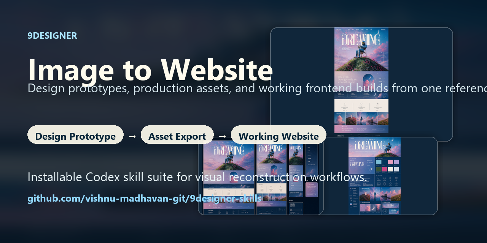
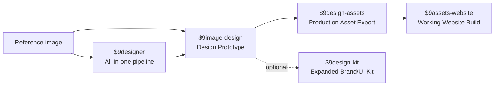

# 9Designer Skills

> Image-to-website Codex skill pipeline: design prototypes, generated assets, and working frontend builds from one reference image.

[](LICENSE)
[](skills/)
[](#how-it-works)

9Designer is a public skill pack for turning a single visual reference image into a complete website workflow:

1. Design a custom landing-page prototype from the image.
2. Export clean production assets with matched logos, icons, UI elements, and backgrounds.
3. Build a working responsive website from those assets.

It is built for visual reconstruction work: reference-led design, exact asset handling, section-by-section implementation specs, and screenshot-based QA.

<p align="center">
  
</p>

## Preview

The example below uses the existing **Dreaming** generated output set.

| Landing page | Brand kit |
| --- | --- |
|  |  |

| UI components | Responsive preview |
| --- | --- |
|  |  |


## How It Works



The all-in-one skill is:

```text
$9designer
image -> design -> assets -> website
```

The modular pipeline is:

```text
$9image-design
image -> design

$9design-assets
design -> assets

$9assets-website
assets -> website
```

Optional expanded kit:

```text
$9design-kit
design -> expanded brand/UI kit
```

## Skills

| Skill | Purpose | Use when |
| --- | --- | --- |
| `$9designer` | Runs the full three-stage image-to-website pipeline | You want one skill to manage the full process |
| `$9image-design` | Generates the first landing page, then the rest of the design system after approval | You want design control before implementation |
| `$9design-assets` | Exports clean, separate production assets | You have approved designs and need implementation-ready images |
| `$9assets-website` | Builds the working responsive website from exported assets | You have an asset export folder |
| `$9design-kit` | Creates optional expanded brand/UI boards | You want a deeper design-system handoff |

## Install

Copy the folders under `skills/` into your Codex skills folder.

Typical user skills folder:

```text
~/.codex/skills/
```

Project-local skill folder:

```text
<project>/.agents/skills/
```

Recommended install layout:

```text
~/.codex/skills/
  9designer/
  9image-design/
  9design-assets/
  9design-kit/
  9assets-website/
```

## Quick Start

For the full pipeline from one image:

```text
Use $9designer with this reference image.
Create the first landing-page prototype, wait for my approval, then export assets and build the working website.
```

For modular control:

```text
Use $9image-design with this reference image.
```

After approving the design:

```text
Use $9design-assets with this approved design.
```

Then:

```text
Use $9assets-website with this asset export folder.
```

## What Makes 9Designer Different

- **Reference-first:** the provided image is the creative source of truth.
- **Approval-gated:** the first landing page is generated before deeper pages or assets.
- **Asset-first implementation:** logos, icons, backgrounds, UI elements, and motifs are generated or sourced before coding.
- **Clean transparency:** reusable assets must not include checkerboards, screenshots, or baked-in page backgrounds.
- **Exact icon treatment:** platform/social icons and custom icons are inventoried and matched instead of swapped for generic placeholders.
- **Code-native text:** navigation, headings, paragraphs, buttons, forms, and footer copy stay real HTML/CSS whenever possible.
- **Section specs before code:** every major section gets copy, asset mapping, tokens, icon rules, states, and responsive behavior.
- **Visual QA:** desktop, tablet, and mobile screenshots are compared against the approved prototype.
- **Optional advanced QA:** teams can add Playwright, pixelmatch, SSIM-style comparison, rembg, SVGO, or other tools later without making them required for basic skill use.
- **Benchmark scoring:** final builds can be scored for fidelity, asset quality, responsiveness, accessibility, build reliability, and QA completeness.

## Benchmark Gallery

Start with the public [Dreaming benchmark seed](docs/examples/dreaming/README.md), then use the [scoring rubric](docs/examples/SCORING_RUBRIC.md) to judge future examples and final website builds.

## Repository Layout

```text
skills/
  9designer/
  9image-design/
  9design-assets/
  9design-kit/
  9assets-website/
docs/
  examples/
  GETTING_STARTED.md
  EXAMPLES.md
  RESEARCH_NOTES.md
  CONTRIBUTOR_WORKFLOW.md
  VALIDATION.md
  GITHUB_SETTINGS.md
  media/
.github/
  ISSUE_TEMPLATE/
  PULL_REQUEST_TEMPLATE.md
```

## Background Cleanup

`$9design-assets` includes:

```text
skills/9design-assets/scripts/remove_background.py
```

Use it after image generation for logos, icons, overlays, dividers, and reusable UI assets:

```bash
python skills/9design-assets/scripts/remove_background.py --input generated.png --output cleaned.png --mode auto
```

`--mode auto` preserves existing alpha, uses optional `rembg` when installed, then falls back to bundled edge-connected cleanup with clear guidance.

The exporter manifest tracks:

```text
asset_role
responsive_variants
accessibility
token_dependencies
icon_policy
qa_notes
background_cleanup_required
background_cleaned
alpha_verified
background_removal_needed
```

Validate an export folder before website handoff:

```bash
python skills/9design-assets/scripts/validate_asset_manifest.py asset-exports/<project> --check-files
```

Do not pass checkerboard-backed or screenshot-backed reusable assets into `$9assets-website`.

## Visual QA Helpers

`$9assets-website` includes optional helpers for final website comparison:

```bash
python skills/9assets-website/scripts/create_fast_track_plan.py --website-root .
python skills/9assets-website/scripts/create_reconstruction_contract.py --website-root . --asset-export asset-exports/<project>
node skills/9assets-website/scripts/capture_visual_qa.mjs --url http://localhost:5173 --out visual-qa/screenshots
node skills/9assets-website/scripts/compare_visual_qa.mjs --reference-dir visual-qa/reference --actual-dir visual-qa/screenshots --out visual-qa/diffs
python skills/9assets-website/scripts/create_visual_qa_ledger.py --website-root . --summary visual-qa/diffs/visual-qa-diff-summary.json
python skills/9assets-website/scripts/score_visual_qa.py --ledger docs/research/VISUAL_QA_LEDGER.md --build-passed --out docs/research/VISUAL_BENCHMARK_SCORE.md
python skills/9assets-website/scripts/validate_production_readiness.py --website-root . --strict
```

Playwright, pixelmatch, and pngjs are optional project-level tools. If they are unavailable, capture screenshots manually and still keep `docs/research/VISUAL_QA_LEDGER.md` with the same mismatch categories.

The production-readiness validator is dependency-free. It checks that the final handoff has a reconstruction contract, QA ledger, benchmark score, local assets, screenshot evidence, and build metadata before the site is called deploy-ready.

Fast mode is supported through `FAST_TRACK_PLAN.md`: it starts route scaffolding, tokens, local asset wiring, header/footer/mobile nav, and page shells early while preserving final production-readiness gates.

## Contributing

Contributions are welcome when they improve the skill pipeline, examples, docs, validation, or generated-asset workflow.

Good first contributions:

- Better prompts for design fidelity.
- Better asset cleanup or validation notes.
- Example outputs from new reference styles.
- More precise website reconstruction QA rules.
- Documentation fixes that make the skill easier to install or use.

Start with [CONTRIBUTING.md](CONTRIBUTING.md), then open an issue or pull request using the templates.

## Maintainer Notes

Suggested GitHub repository settings:

- Description: `Image-to-website Codex skill pipeline: design prototypes, generated assets, and working frontend builds from one reference image.`
- Topics: `codex-skills`, `image-to-website`, `design-to-code`, `screenshot-to-code`, `website-cloning`, `image-generation`, `frontend`, `react`, `vite`, `ai-design`
- Social preview image: `docs/media/social-preview.png`

See [docs/GITHUB_SETTINGS.md](docs/GITHUB_SETTINGS.md) for the exact setup checklist.

## Research Notes

9Designer borrows proven patterns from public screenshot-to-code, visual editor, and visual regression workflows. See [docs/RESEARCH_NOTES.md](docs/RESEARCH_NOTES.md) for the current research log and improvement backlog.

## Roadmap

The current repo keeps advanced tooling optional. See [docs/ROADMAP.md](docs/ROADMAP.md) for the phased plan covering manifest/script upgrades, automated visual QA, benchmark examples, and deployment showcase work.
