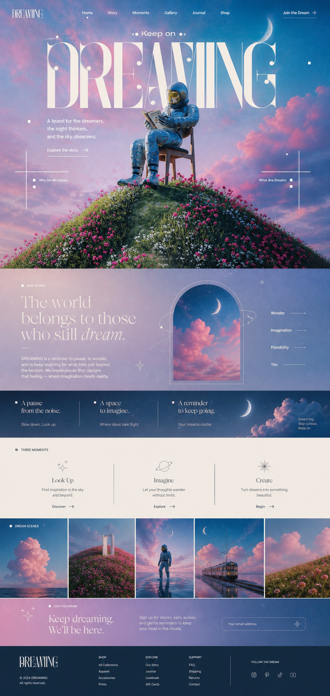
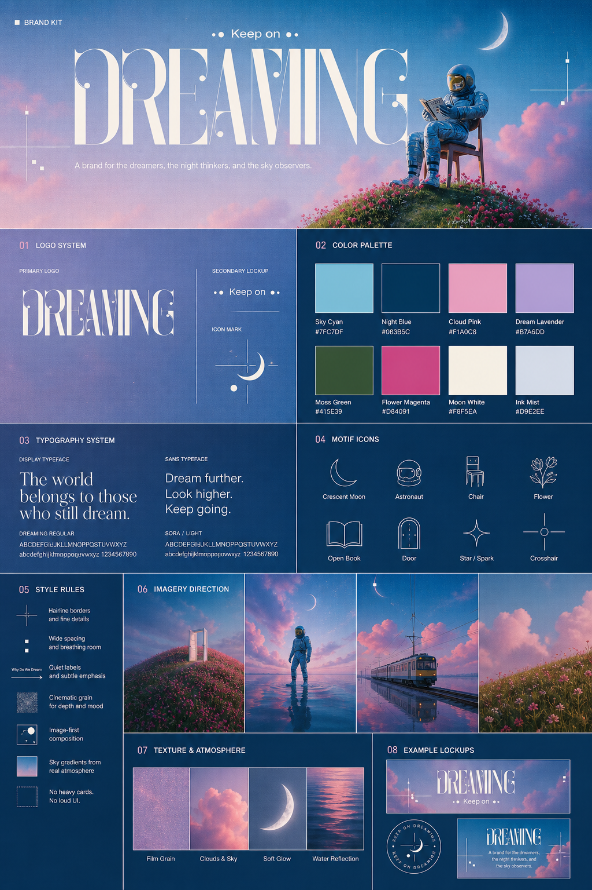
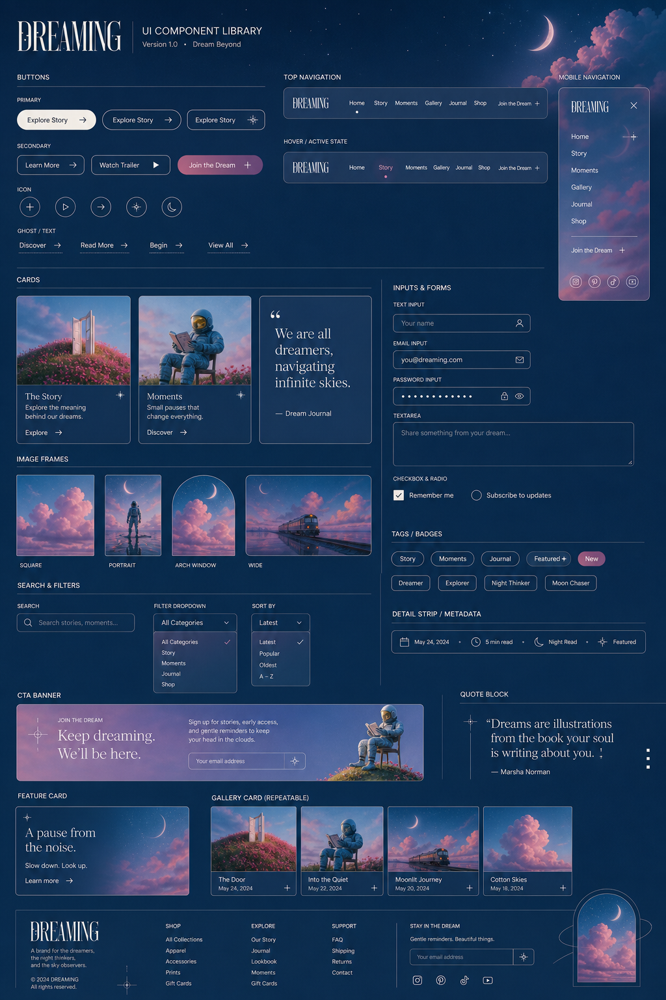
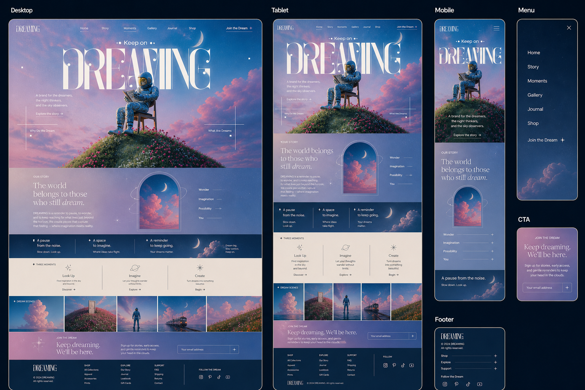
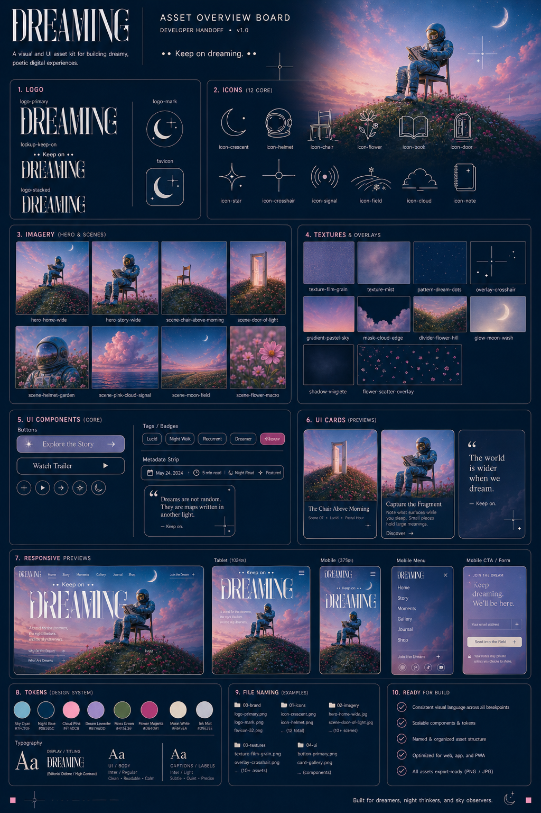

# Dreaming Benchmark Seed

Dreaming is the first public example set for 9Designer. It demonstrates the intended visual direction for an atmospheric, editorial, surreal image-to-website pipeline.

Status: **seed benchmark**

Current coverage: design prototype boards, brand kit board, UI component board, responsive preview board, and asset overview.

Pending for complete benchmark status: rendered working website screenshots and final build QA ledger.

## Preview

| Landing page | Brand kit |
| --- | --- |
|  |  |

| UI components | Responsive preview |
| --- | --- |
|  |  |

## What This Example Tests

- Surreal image-led hero composition.
- Atmospheric color and lighting preservation.
- Decorative typography and brand-kit extraction.
- UI component system consistency.
- Responsive preview expectations.
- Asset overview readability for implementation handoff.

## Pipeline Notes

The example follows the standard 9Designer flow:

1. `9image-design`: create the approved landing-page concept and design boards.
2. `9design-assets`: export individual logos, icons, UI elements, textures, and backgrounds.
3. `9assets-website`: build the real website from local assets.
4. Visual QA: capture screenshots, compare against references, write ledger, score benchmark.

The public media currently shows the design/prototype side of the pipeline. A complete benchmark should add rendered website screenshots and a final QA score once a deployable site is generated from this kit.

## Current Score

See [visual-benchmark-score.md](visual-benchmark-score.md).

This score is intentionally marked as provisional because the rendered website QA artifacts are not yet included.

## Public Safety

The images linked here are existing generated demo assets from this repository. Do not add private reference images or client screenshots to this folder.
